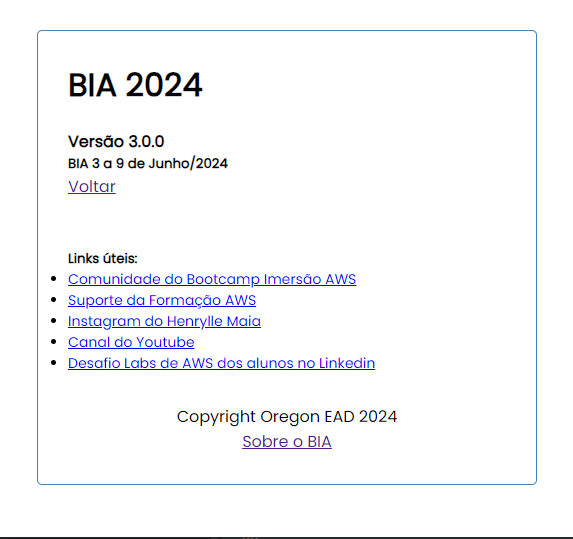
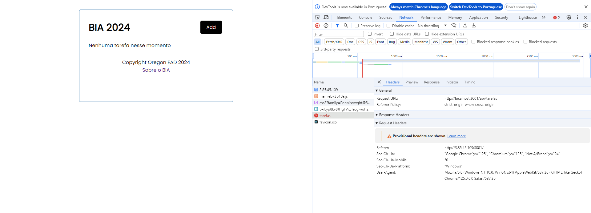
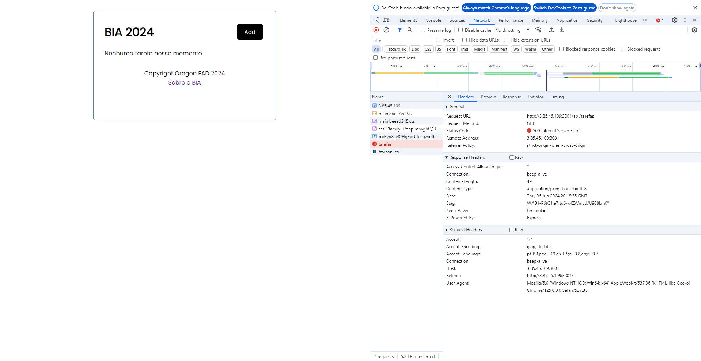
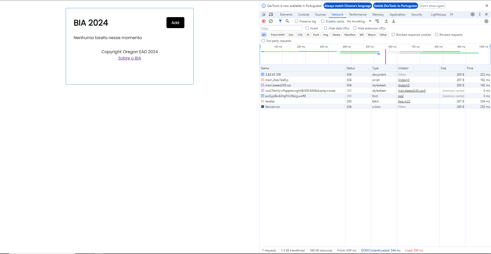
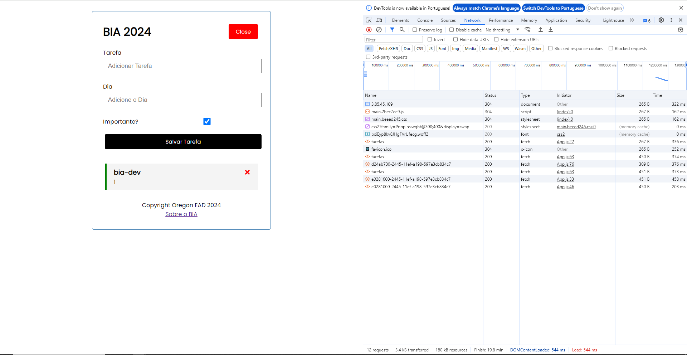

# Projeto Bia

Repositório do projeto: [github.com/henrylle/bia](https://github.com/henrylle/bia)

## AWS

Acessar console https://console.aws.amazon.com/

Criar conta

## CloudShell

Clonar o projeto

```bash 
git clone https://github.com/henrylle/bia.git
Cloning into 'bia'...
remote: Enumerating objects: 1941, done.
remote: Counting objects: 100% (369/369), done.
remote: Compressing objects: 100% (92/92), done.
remote: Total 1941 (delta 344), reused 277 (delta 277), pack-reused 1572
Receiving objects: 100% (1941/1941), 3.83 MiB | 29.69 MiB/s, done.
Resolving deltas: 100% (727/727), done.
```

## Acessar pasta bia/script

```bash
cd bia/scripts
```

## Executar script de validação

```bash
./validar_recursos_zona_a.sh 
[OK] Tudo certo com a VPC
[OK] Tudo certo com a Subnet
[OK] Security Group bia-dev foi criado
 [OK] Regra de entrada está ok
 [OK] Regra de saída está correta
>[ERRO] A role 'role-acesso-ssm' não existe
```

## Criar a role 'role-acesso-ssm'

```bash
./criar_role_ssm.sh
{
    "Role": {
        "Path": "/",
        "RoleName": "role-acesso-ssm",
        "RoleId": "AROAQ3EGUMIUIMZEKHK5T",
        "Arn": "arn:aws:iam::058264412712:role/role-acesso-ssm",
        "CreateDate": "2024-06-06T18:00:30+00:00",
        "AssumeRolePolicyDocument": {
            "Version": "2012-10-17",
            "Statement": [
                {
                    "Effect": "Allow",
                    "Principal": {
                        "Service": "ec2.amazonaws.com"
                    },
                    "Action": "sts:AssumeRole"
                }
            ]
        }
    }
}
{
    "InstanceProfile": {
        "Path": "/",
        "InstanceProfileName": "role-acesso-ssm",
        "InstanceProfileId": "AIPAQ3EGUMIUGC5MNWW7G",
        "Arn": "arn:aws:iam::058264412712:instance-profile/role-acesso-ssm",
        "CreateDate": "2024-06-06T18:00:30+00:00",
        "Roles": []
    }
}
```

## Executar novamente o ./validar_recursos_zona_a.sh 

```bash
./validar_recursos_zona_a.sh 
[OK] Tudo certo com a VPC
[OK] Tudo certo com a Subnet
[OK] Security Group bia-dev foi criado
 [OK] Regra de entrada está ok
 [OK] Regra de saída está correta
[OK] Tudo certo com a role 'role-acesso-ssm'
```

## Verificar no console se a ROLE 'role-acesso-ssm' foi criada.

Pesquisar por IAM / Roles

Gerenciamento de acesso / Funções

## Criar máquina de trabalho

### Via console

EC2

Nome: bia-dev

Imagem: Amazon Linux

Tipo: t3.micro

Par de chaves: Prosseguir sem

Escolher Security Group existente: bia-dev

Advanced Details

IAM instance profile: role-acesso-ssm

User Data: Copiar user_data_ec2_zona_a.sh

### Via script

lancar_ec2_zona_a.sh

Depois de criada, conectar / Gerenciador de sessões

## Mudar para o usuário ec2-user

```bash
sudo su ec2-user
```

Acessar a home 

```bash
cd /home/ec2-user
```

## Clonar o projeto pra dentro da instância

```bash
git clone https://github.com/henrylle/bia.git
```

## Acessar a pasta do projeto: bia

```bash
cd bia
```

## Verificar se o Docker e o Docker-compose estão instalados

```bash
docker --version
	Docker version 25.0.3, build 4debf41

docker compose version
	Docker Compose version v2.23.3
```

## Executar o docker compose

```bash
docker compose up -d
```

## Verificar a aplicação

```bash
docker ps
CONTAINER ID   IMAGE           COMMAND                  CREATED          STATUS          PORTS                                       NAMES
5d58aa525703   bia-server      "docker-entrypoint.s…"   16 minutes ago   Up 16 minutes   0.0.0.0:3001->8080/tcp, :::3001->8080/tcp   bia
fd75597b1715   postgres:16.1   "docker-entrypoint.s…"   16 minutes ago   Up 16 minutes   0.0.0.0:5433->5432/tcp, :::5433->5432/tcp   database
```

## Acessar via Browser

http://`ip publico da instância`:3001



## Criando roles adicionais para role-acesso-ssm

ECR - Subir imagem - AmazonEC2ContainerRegistryFullAccess

ECS - Fazer deploy - AmazonECS_FullAccess

Anexar politicas (polices)

AmazonEC2ContainerRegistryFullAccess
AmazonECS_FullAccess


## Verificar AWS

```bash
aws --version
aws-cli/2.15.30 Python/3.9.16 Linux/6.1.91-99.172.amzn2023.x86_64 source/x86_64.amzn.2023 prompt/off
```

## Verificar permissões

```bash
 aws ecr describe-repositories
{
    "repositories": []
}
```

A aplicação está respondendo como localhost



Precisa alterar para o IP Público da instância na AWS no console da AWS

Dockerfile

    FROM node:21-slim

    RUN npm install -g npm@latest --loglevel=error
    WORKDIR /usr/src/app

    COPY package*.json ./

    RUN npm install --loglevel=error

    COPY . .

    RUN REACT_APP_API_URL=http://localhost:3001 SKIP_PREFLIGHT_CHECK=true npm run build --prefix client

    RUN mv client/build build

    RUN rm  -rf client/*

    RUN mv build client/

    EXPOSE 8080

    CMD [ "npm", "start" ]


## Alterações no Dockerfile

```bash
vi Dockerfile
```
Alterar de

    RUN REACT_APP_API_URL=http://localhost:3001 SKIP_PREFLIGHT_CHECK=true npm run build --prefix client

Para

    RUN REACT_APP_API_URL=http://`IP PUBLICO`:3001 SKIP_PREFLIGHT_CHECK=true npm run build --prefix client

## Derrubar a aplicação

```bash
docker compose down
```

## Buidando a aplicação server para atualizar as modificações

```bash
docker compose build server
```

=> [server  7/10] RUN REACT_APP_API_URL=http://3.85.45.109:3001 SKIP_PREFLIGHT_CHECK=true npm run build --prefix client 


## Executar o docker compose

```bash
docker compose up -d

[+] Running 3/3
 ✔ Network bia_default  Created
 ✔ Container database   Started
 ✔ Container bia        Started
```

## 500 Internal Server Error



Motivo, a tabela tarefas ainda não existe!

Precisa rodar as migrations

```bash
docker compose exec server bash -c 'npx sequelize db:migrate'

Sequelize CLI [Node: 21.7.3, CLI: 6.6.2, ORM: 6.37.0]

Loaded configuration file "config/database.js".
== 20210924000838-criar-tarefas: migrating =======
== 20210924000838-criar-tarefas: migrated (0.022s)
```

## 200 OK


## CRUD


